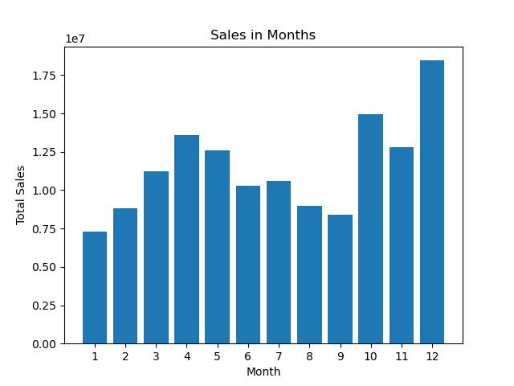
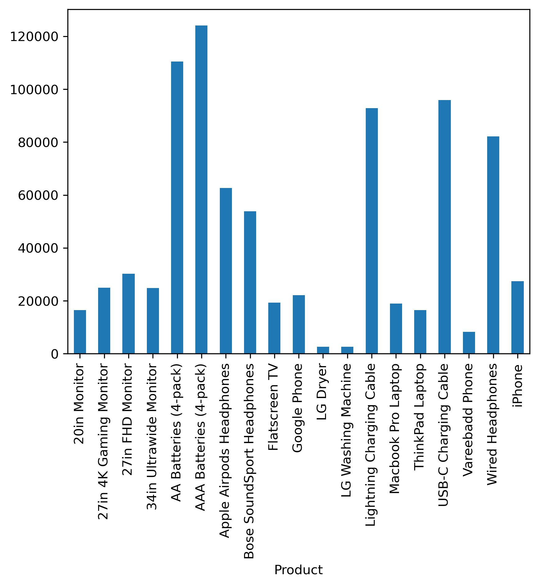

📊 Analyse des ventes d’une boutique de gadgets
🎯 Objectif
Ce projet vise à analyser les ventes mensuelles d’une boutique fictive de smartphones et gadgets à partir de données fournies sous forme de fichiers CSV.

🔍 ##Points étudiés:
✅ 📅 Meilleur mois en chiffre d’affaires
➡️ Identification du mois où les ventes ont été les plus élevées.

✅ 📍 Ville avec le plus de commandes
➡️ Analyse de la répartition des ventes par localisation.

✅ ⏰ Moment optimal pour une campagne publicitaire
➡️ Détermination des périodes idéales pour maximiser les ventes.

Lien pour la presentation :https://www.canva.com/design/DAGes14q494/rfiIpMjqAZKq9tXaqrF5hw/edit?utm_content=DAGes14q494&utm_campaign=designshare&utm_medium=link2&utm_source=sharebutton
